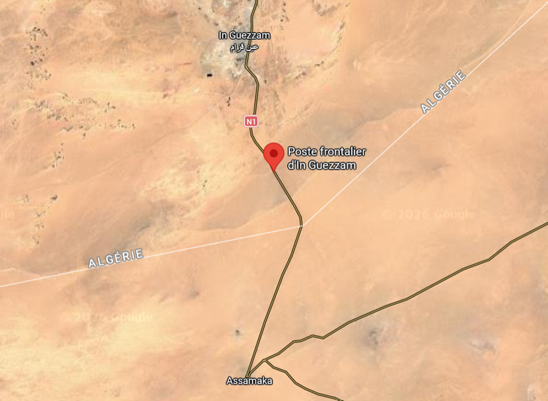
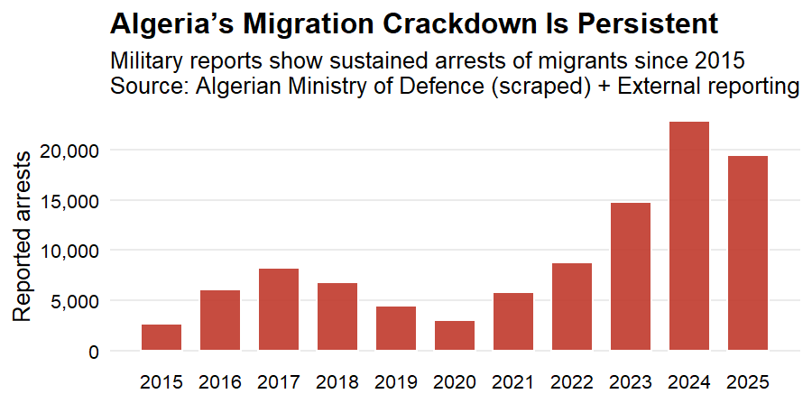

Algeria is one of Africa’s most security-focused states, with a defence budget of [around](https://www.newarab.com/news/defence-remains-algerias-top-yearly-expenditure-2026) \$25 billion—and migration is firmly part of this security agenda. While countries such as Egypt, Libya, Morocco, and Tunisia have all, to varying degrees, yielded to pressure from the European Union in exchange for economic benefits tied to reducing migration, Algeria has [refused](https://www.ispionline.it/en/publication/rocky-road-ahead-the-challenges-of-eu-algeria-relations-181457) to do so, firmly [emphasizing](https://www.elmoudjahid.dz/fr/actualite/solidarite-avec-les-pays-africains-un-principe-fondamental-pour-l-algerie-5058) its sovereignty and a commitment to African solidarity. But opacity does not mean inactivity!  Beneath the surface, Algeria has built its own dense [system](https://ftdes.net/en/suppression-of-movement-migration-control-manufactured-precarity-and-racialised-border-regimes-in-post-hirak-algeria-in-the-name-of-sovereignty-at-the-service-of-rent-accumulation/) of migration control. What we know about this system comes largely from scattered reports by human rights [organizations](https://alarmephonesahara.info/fr/dossiers/dossier-2-les-meilleurs-endroits-pour-faire-la-sieste). These organisations [report](https://www.medecinssansfrontieres.ca/niger-les-expulsions-mettent-en-danger-la-vie-des-migrants/) on mass expulsions of Sub-Saharan migrants amounting to more than 30 000 per year in 2023 and 2024. They take the form of systematic raids in major northern cities. In cities like Algiers and Oran, migrants are routinely swept up in large-scale raids and deported to Niger—often under conditions that amount to human rights violations.

## From Urban Raids to Desert Borders

“The conditions of arrest, detention, and expulsion carried out by the Algerian government do not respect the fundamental principle of non-refoulement and constitute practices that violate international human rights law and international refugee law,” [explains](https://www.medecinssansfrontieres.ca/niger-les-expulsions-mettent-en-danger-la-vie-des-migrants/) Jamal Mrrouch, head of mission for MSF in Niger. The figures reported largely capture people inside the country. But the regime’s hardline approach is already evident at the borders—particularly at the crossing of In Guezzam. Beyond these largely hidden expulsions, migrants are arrested daily at border points and swiftly deported.

{fig-align="center" width="70%"}

Here, numbers remain snapshots rather than a full picture. So I went looking for the traces. This Databit is based on a dataset scraped from weekly operational reports published by the [Algerian Ministry of Defence](https://www.mdn.dz/site_principal/sommaire/archives/archives_actualites_fr.php). Buried in archived web pages and formatted inconsistently, these reports are one of the few official sources that regularly mention migration-related arrests. Using web scraping techniques in R, I collected more than 100 reports spanning 2015 to 2025 and complemented them with older reports hidden in archived local news articles. I extracted arrest figures, cleaned inconsistent formats, and assembled them into a single dataset.

## Following the Traces in Official Data

{fig-align="center" width="70%"}

What emerges is rare: a longitudinal view of Algeria’s enforcement practices at its borders. Arrest figures reported by the military show sustained and, in some periods, rising levels of enforcement activity. These are not isolated incidents, but part of a routinized system: patrols, interceptions, and arrests carried out by the gendarmerie and border forces.

## Enforcement Tightens Since 2023

Official figures are not independently verifiable and must be treated with caution. Governments have incentives to frame enforcement in particular ways. Yet, when triangulated with reporting from organizations like [Amnesty International](https://reliefweb.int/report/algeria/forced-leave-stories-injustice-against-migrants-algeria) or [Human Rights Watch](https://www.hrw.org/news/2020/10/09/algeria-migrants-asylum-seekers-forced-out), a consistent picture emerges: large-scale arrests are on the rise since 2023. Algeria’s refusal to cooperate with the EU does not mean it resists the broader trend toward restrictive migration governance. On the contrary, even without formal agreements, Algeria has developed practices that mirror the logic of “Fortress Europe”: containment, deterrence, and expulsion even before the EU began to externalize its borders. ---

------------------------------------------------------------------------

::: author-box
Author: Sophia Hiss

Sophia is a Master's student in International Affairs, focusing on migration and security in North Africa.
:::

------------------------------------------------------------------------

\

\

## 
